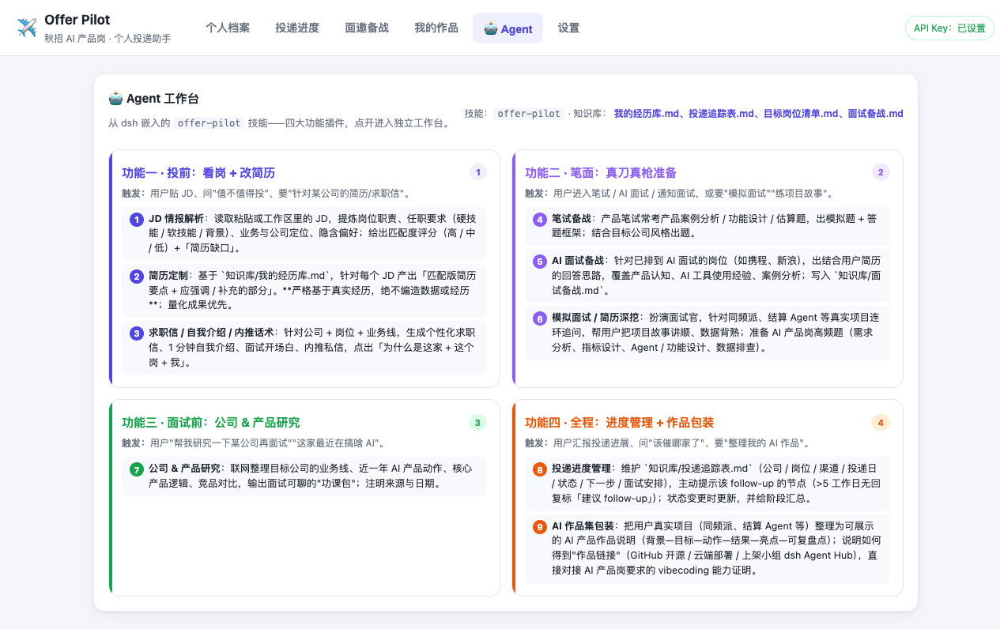
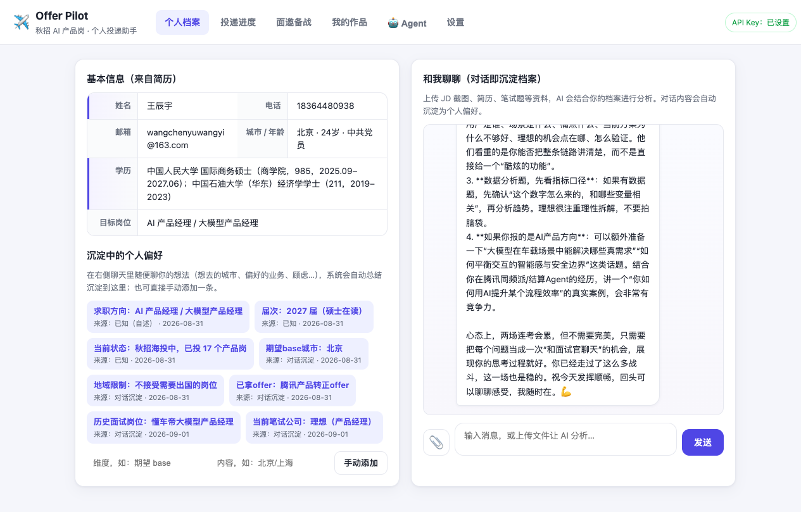
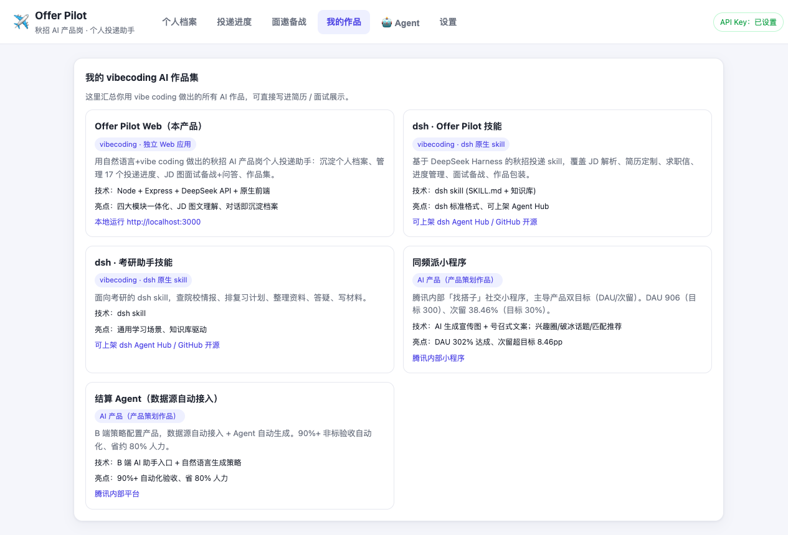

# Offer Pilot · 秋招 AI 产品岗个人助手

> **一个独立运行的 AI 求职助手**——帮秋招候选人沉淀个人画像、管理 18 家公司的投递进度、上传 JD 图文自动备战面试，并嵌入 4 大 dsh Agent 插件让 AI 真正"懂"你的求职场景。
>
> 全栈 vibe coding 独立开发 · MIT 开源 · Key 不离开本机

<p align="center">
  
</p>

---

## 🎯 它解决什么问题

秋招季同时投十几二十家产品岗，每个公司进度分散在邮箱/微信/短信/招聘官网各处，JD 散落桌面，面试备战全凭记忆，**「我到底走到哪一步了、下一步该做什么」** 这种最基本的问题反而最没人答。

Offer Pilot 把这些事**收进一个工具**：

- 🗂️ **进度一屏看清**：11 阶段流水线（简历筛选→评估→笔试→一二三面→offer），可视化漏斗图
- 🧠 **AI 真懂你**：聊天即沉淀档案，AI 基于你的真实偏好回答问题
- 📸 **JD 丢给它就行**：上传 JD 截图，5 秒出自我介绍+预测题+建议回答
- 🤖 **4 大 Agent 插件**：嵌入 dsh skill，覆盖"看岗改简历/笔面备战/公司研究/进度管理"
- ⏰ **DDL 不会忘**：每场面试设截止时间，状态自动变色，到点联动企微日历提醒

---

## ✨ 五大模块

### 📊 投递进度（核心场景）
完整的投递漏斗 + 18 家公司清单，阶段可下拉直接改、关键行动自动建议。
<p align="center"></p>

### 🤖 Agent 工作台（差异化亮点）
从 dsh 嵌入的 4 大功能插件——点开任一卡片，进入独立的 AI 工作台，系统提示词 + 知识库上下文全自动加载。
<p align="center"></p>

### 🧠 个人档案 + 对话
基本信息结构化沉淀，**聊天即沉淀档案**——随口聊的偏好自动抽取为标签，无需手动填表。
<p align="center"></p>

### 📚 面邀备战
上传 JD（文字 or 截图）→ AI 自动拆解岗位要求 + 生成自我介绍 + 预测面试题 + 知识储备清单。DDL 状态自动变色（🟢 正常 / 🟡 即将到期 / 🔴 已过期）。
<p align="center"></p>

### 🎨 作品集
把 vibecoding 出的所有 AI 作品一键汇总，附技术栈、亮点、可展示链接——直接对接 AI 产品岗要求的 vibecoding 能力证明。
<p align="center"></p>

---

## 🧰 技术栈

```
后端   Node.js + Express    零依赖，仅 express 一个包
AI     DeepSeek API          Key 通过 .env 本地加载，不离开机器
前端   原生 HTML/CSS/JS     零构建，单页应用
数据   本地 JSON 文件        store.json + 知识库 markdown
Agent  嵌入 dsh SKILL.md    4 大插件独立加载系统提示词 + KB
```

### 为什么不用框架
- **零构建**：刷新浏览器即可看效果，符合 vibecoding "所见即所得" 心智
- **零依赖**：只有 `express`，仓库小、clone 快、新人友好
- **隐私优先**：Key 仅在本地 `.env`，数据存 `data/store.json`，不上传任何东西

---

## 🚀 5 分钟跑起来

```bash
# 1. 克隆
git clone https://github.com/Eurus918/offer-pilot-web.git
cd offer-pilot-web

# 2. 装依赖
npm install

# 3. 配置 Key（可选，不填也能用其他模块）
cp .env.example .env
# 编辑 .env，填入你的 DeepSeek Key（https://platform.deepseek.com 获取）

# 4. 启动
npm start
# → 打开 http://localhost:3000
```

> **不填 Key 也能用**：个人档案（手动偏好）、投递进度管理、作品集——这些不调用 AI 的模块都能正常使用。填了 Key 才解锁 AI 聊天、JD 图分析、Agent 工作台。

---

## 🗂️ 项目结构

```
offer-pilot-web/
├── server.js              # Express 后端（路由 + DeepSeek 代理 + Agent 插件引擎）
├── package.json           # 仅一个依赖：express
├── render.yaml            # Render 一键部署配置（可选）
├── public/                # 前端（HTML/CSS/JS，零构建）
│   ├── index.html
│   ├── styles.css
│   └── app.js
├── data/
│   ├── store.json         # 真实数据（gitignore，不进仓库）
│   └── store.example.json # 脱敏示例，clone 后自动复制为 store.json
├── agent-kb/              # 知识库（指向 offer-pilot-agent/知识库/）
│   ├── 我的经历库.md
│   ├── 目标岗位清单.md
│   ├── 投递追踪表.md
│   └── 面试备战.md
├── docs/                  # 产品文档 + 截图
│   ├── screenshots/       # README 用图
│   ├── methodology.md     # 结算 Agent 设计方法论
│   └── deploy.md          # 公网部署指南
├── .env.example           # 环境变量模板
├── .gitignore             # 排除 .env / store.json / node_modules
└── README.md              # 你正在看的
```

---

## 🤖 Agent 工作台原理

每个 Agent 插件都遵循 dsh 标准格式：

1. **启动时**：后端读取 `agent-kb/SKILL.md`（或嵌入的 `offer-pilot/SKILL.md`），解析 frontmatter + 4 大功能章节
2. **用户点击插件**：前端展示卡片 + 工作台对话框
3. **用户提问**：后端自动拼接 system 提示词 = `SKILL.md 通用约定 + 当前功能章节 + 知识库上下文`，调用 DeepSeek
4. **流式返回**：AI 回复渲染为气泡（Markdown 风格）

**关键设计**：知识库驱动——AI 的回答不是通用建议，而是**基于你的真实数据**给出的。

---

## 🔗 配套作品（同作者）

| 仓库 | 说明 |
|---|---|
| [offer-pilot-skill](https://github.com/Eurus918/offer-pilot-skill) | dsh 上的 offer-pilot 技能（Agent 工作台的能力源头） |
| [kaoyan-skill](https://github.com/Eurus918/kaoyan-skill) | dsh 上的考研助手技能（同款技能化思路） |
| [Eurus918/offer-pilot-web](https://github.com/Eurus918/offer-pilot-web) | 本仓库 |

配套文档：
- [`docs/methodology.md`](docs/methodology.md) — 《结算 Agent 设计方法论》：B 端 AI 产品的双入口架构、数据一致性、边界划分等深度思考

---

## 🌐 公网部署（可选）

| 平台 | 状态 | 备注 |
|---|---|---|
| Render | ✅ render.yaml 已就位 | 需要国际信用卡做 $1 验证 |
| Railway | ⚠️ 免费额度极低 | $5/30天 + $1/月，长驻 Express 会停服 |
| 腾讯云轻量 | ✅ 适合国内访问 | 学生认证后 ¥25.92 起/3 月 |
| 内网穿透（ngrok/cloudflared） | ❌ 公司办公网禁止 | 会触发 IT 安全告警 |

详见 [`docs/deploy.md`](docs/deploy.md)。

---

## 📝 License

[MIT](LICENSE)

---

> Built with 💜 by 王辰宇 · 2026 届 · 求职方向：AI 产品经理 / 大模型产品经理
> 联系：wangchenyuwangyi@163.com