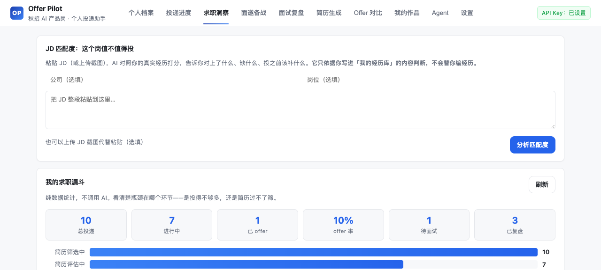
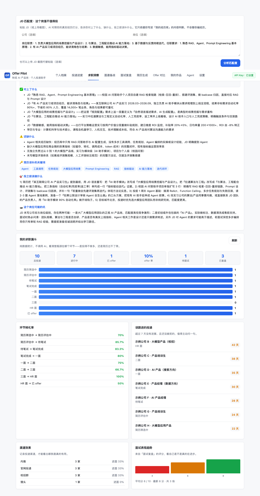
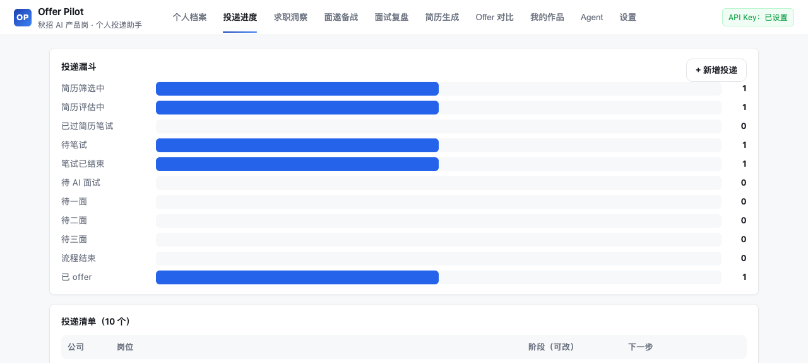
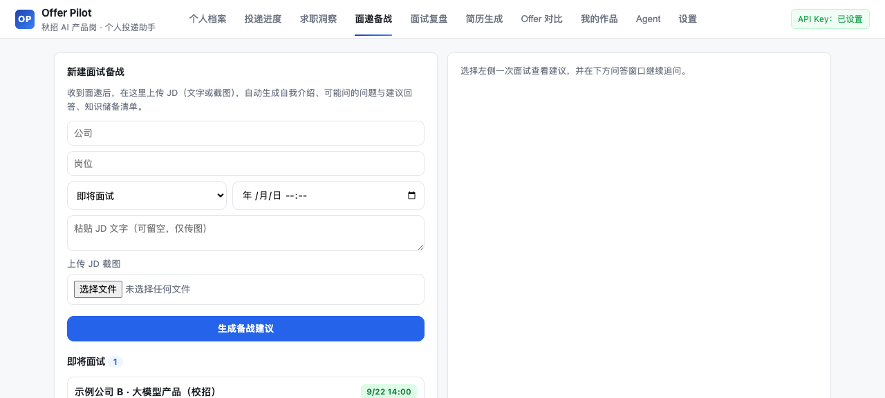
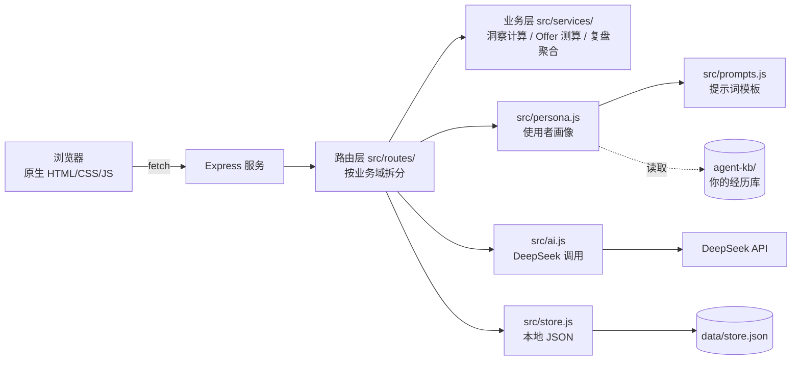

# Offer Pilot · 求职 AI 助手

> 一个跑在你本机的求职助手——管投递进度、看 JD 值不值得投、AI 陪你练面试、面完自动复盘。
>
> **数据只存在你自己的电脑上。AI 只讲你写过的经历，不会替你编。**

<p align="center">
  
</p>

---

## 它解决什么问题

求职季同时投十几二十家，进度散在邮箱、微信、招聘官网各处，JD 散在桌面，面试准备全凭记忆。
最基础的三个问题反而没人答：**我投到哪一步了？这个岗该不该投？我上次面试到底栽在哪？**

Offer Pilot 把它们收进一个工具，并串成一条闭环：

```
投前：这个岗值不值得投  →  投中：我的漏斗哪里在漏  →  面后：我进步了吗
   JD 匹配度打分            投递数据洞察              面试复盘 + 得分趋势
                                                          ↓
                                                    反哺下次备战
```

最后那根箭头是这个工具最不一样的地方：**复盘结论会自动注入下一次备战**。
上一场被问住的题，下次生成备战包时会强制覆盖——"答砸过的题，别再答砸一次"。

---

## 功能模块

| 模块 | 干什么 | 需要 API Key 吗 |
|---|---|---|
| 🗂️ **投递进度** | 11 阶段流水线 + 漏斗图，阶段下拉直接改 | 否 |
| 📊 **求职洞察** | 转化率、卡住的投递、渠道进面率、表现趋势 | 否 |
| 🎯 **JD 匹配度** | 贴 JD → 0-100 打分 + 该不该投 + 投前补什么 | 是 |
| 📚 **面邀备战** | JD 图/文 → 自我介绍 + 预测题 + 知识清单 | 是 |
| 🎙️ **AI 模拟面试** | AI 扮面试官追着问，答得浅就多问一层，结束出评价 | 是 |
| 🔍 **面试复盘** | 粘会议纪要 → 结构化复盘（评分/强弱项/改进清单） | 是 |
| 📝 **简历生成** | 先追问信息缺口，再按目标岗位出针对性简历 | 是 |
| ⚖️ **Offer 对比** | 总包扣掉城市生活成本看真实可支配，AI 给有立场的建议 | 是 |
| 🤖 **Agent 工作台** | 4 大技能插件，加载你的知识库回答 | 是 |
| 🧠 **个人档案** | 聊天即沉淀偏好，随口说的城市/倾向自动变成标签 | 是 |

> 不填 Key 也能用：投递进度、求职洞察、作品集这些不调 AI 的模块照常工作。

### 界面一览

**JD 匹配度**——对上了什么、缺什么、投之前补什么，直接给结论：

<p align="center"></p>

**投递进度**与**面邀备战**：

<p align="center">
  &nbsp;
  
</p>

> 以上截图全部来自仓库自带的演示数据（`data/store.demo.json`），不含任何真实个人信息。

---

## 跑起来

```bash
git clone https://github.com/Eurus918/offer-pilot-web.git
cd offer-pilot-web
npm install
cp .env.example .env      # 可选：不填 Key 也能用一半功能
npm start                 # → http://localhost:3000
```

需要 Node 18+。整个项目只有 `express` 一个依赖。

### 首次打开，做三件事

1. **填档案**（姓名 / 学历 / 目标岗位）——AI 的所有建议都基于它生成。不填，AI 只能给通用话术。
2. **填 API Key**（可选）——[platform.deepseek.com](https://platform.deepseek.com) 获取，sk- 开头。
3. **写经历库** ——打开 `agent-kb/我的经历库.md`，按模板填你自己的项目和数字。

**第 3 步最值钱。** AI 严格只讲你写在这里的经历，绝不编造：你没写过的东西，它会当作"缺口"告诉你去补，而不是假装你有。
写得越具体（尤其量化结果），简历和面试建议的质量差得越明显。

想先看看效果？把 `data/store.demo.json` 复制成 `data/store.json`，有一份演示数据。

---

## 数据存在哪

| 内容 | 位置 | 会不会上传 |
|---|---|---|
| 投递记录、档案、复盘 | `data/store.json` | 不上传，也不进仓库（已 gitignore） |
| API Key | `.env` 或设置页 | 不上传，不进仓库 |
| 经历库、JD 笔记 | `agent-kb/*.md` | 不上传，不进仓库 |

所有 AI 请求由你的浏览器 → 本机 Node 服务 → DeepSeek 官方接口，中间没有任何第三方。
项目没有埋点、没有 telemetry。

---

## 架构



请求链路只有一跳，没有任何中间层。

```
offer-pilot-web/
├── server.js              入口：装配与启动
├── src/
│   ├── config.js          路径、环境变量、城市成本表
│   ├── store.js           本地数据读写、schema 归一化
│   ├── ai.js              DeepSeek 调用（超时/重试/JSON 容错）
│   ├── persona.js         使用者画像（所有 prompt 的背景来源）
│   ├── prompts.js         提示词集中管理
│   ├── errors.js          统一错误处理与中文提示
│   ├── context.js         运行时上下文
│   ├── kb.js              知识库初始化
│   ├── routes/            HTTP 接口（按业务域拆分）
│   └── services/          业务逻辑（洞察 / Offer / 复盘）
├── public/                前端三件套，零构建
├── agent-skills/          内置技能手册（Agent 工作台的能力来源）
├── agent-kb.example/      知识库模板（首次启动自动生成为 agent-kb/）
└── data/                  你的数据（不进仓库）
```

### 几个设计取舍

**为什么不用框架**：零构建、零编译，改完刷新就能看到效果。整个仓库只有一个依赖（express），clone 快、新人看得懂。

**为什么 AI 只讲你写过的经历**：这是刻意的约束。求职助手最容易犯的错是"帮你编一段漂亮但不存在的经历"——简历过了筛，面试当场露馅。
所以系统提示词里写死了：经历库里没有的，一律算缺口。宁可让你补，也不替你编。

**为什么洞察模块不调 AI**：统计就是统计，用不上大模型，还省一次调用。没配 Key 的人也能立刻看到自己的漏斗。

**为什么要先追问再生成简历**：直接生成的话，AI 只能靠猜填空白。先问清量化成果和关键贡献，出来的简历才有说服力。

---

## 常见问题

**没配 API Key 能用吗？**
能。投递进度、求职洞察、作品集都不依赖 AI。配了 Key 才解锁 JD 分析、模拟面试、简历生成、复盘。

**AI 说"没有你的经历信息"怎么办？**
去 `agent-kb/我的经历库.md` 填。那是 AI 唯一的事实来源。

**想换模型？**
设置页可以改，或者设环境变量 `DEEPSEEK_MODEL`。默认 `deepseek-chat`。

**腾讯会议自动同步纪要为什么用不了？**
那是可选功能，有硬性平台门槛：账号需商业版/企业版/教育版，应用需"查看企业录制"权限，2026-02 起新建自建应用还要 STS-Token。
个人版账号用不了——这是平台限制。没配凭证时不影响手动粘贴纪要。见 [`docs/tencent-meeting-api.md`](docs/tencent-meeting-api.md)。

**能部署到公网吗？**
可以，`render.yaml` 已就位。但建议只在公网部署一份**不含真实数据**的实例——本工具的设计前提就是数据在你本机。

**数据结构变了怎么办？**
启动时会自动做 schema 归一化，老数据能安全加载。`store.json` 若解析失败会自动备份而不是崩溃。

---

## 配置参考

| 环境变量 | 说明 | 默认值 |
|---|---|---|
| `DEEPSEEK_API_KEY` | API Key，也可在设置页填 | — |
| `DEEPSEEK_MODEL` | 模型名 | `deepseek-chat` |
| `PORT` | 端口 | `3000` |
| `AI_TIMEOUT_MS` | AI 请求超时 | `120000` |
| `OFFER_PILOT_SKILL_FILE` | 自定义 Agent 技能手册路径 | 仓库内置那份 |
| `OFFER_PILOT_KB_DIR` | 自定义知识库目录 | `agent-kb/` |

---

## License

[MIT](LICENSE)

---

> Built with 💜 by 王辰宇 · 联系：wangchenyuwangyi@163.com
>
> 欢迎提 issue 和 PR。如果你也在求职，祝顺利。
